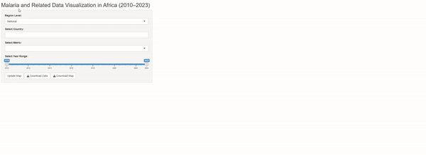
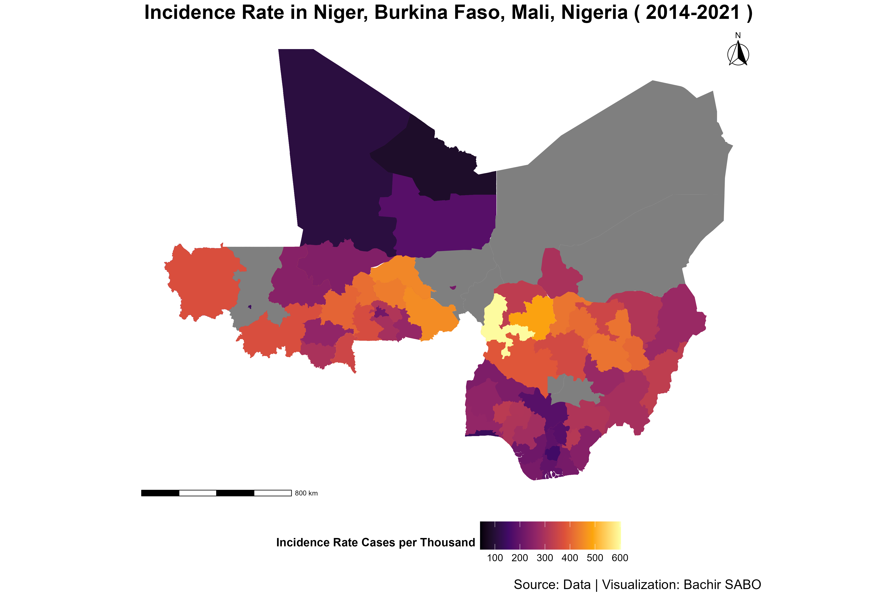
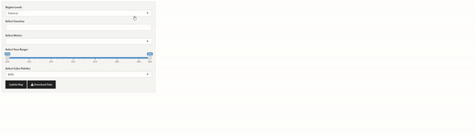

# Malaria and Related Data Visualization in Africa (2010–2023)

[](https://cran.r-project.org/)
[](https://shiny.rstudio.com/)
[](https://rstudio.github.io/leaflet/)
[](https://geojson.org/)
[](https://dplyr.tidyverse.org/)


This Shiny app provides interactive visualizations of malaria and related data across various African countries from 2010 to 2023. Users can explore national and subnational data, select various metrics, and customize visualizations for deeper insights into the malaria situation in Africa. Developed by Bachir SABO, this app uses `R`, `shiny`, `ggplot2`, `leaflet`, and several other R packages for data manipulation and visualization.

## Table of Contents

- [Features](#features)
- [Installation](#installation)
- [Usage](#usage)
- [Data Sources](#data-sources)
- [Customization](#customization)
- [Sample Visuals](#sample-visuals)
- [Contributing](#contributing)
- [License](#license)

## Features

- **Map-Based Visualization**: Display national or subnational malaria data on an interactive map.
- **Customizable Parameters**: Choose countries, metrics, color palettes, and year ranges for focused analysis.
- **Downloadable Data**: Users can download the filtered data for offline analysis.
- **Responsive UI**: The app is responsive and easy to use on desktop and mobile devices.

## Installation

1. **Clone the repository**:
    ```bash
    git clone https://github.com/S-bachir/RShiny_Malaria.git
    cd RShiny_Malaria
    ```

2. **Install the required R packages**:
    In R, run:
    ```R
    install.packages(c("shiny", "sf", "ggplot2", "viridis", "dplyr", "readr", 
                       "ggspatial", "countrycode", "bslib", "leaflet", 
                       "RColorBrewer", "shinythemes", "mapview"))
    ```

3. **Run the app**:
    ```R
    shiny::runApp()
    ```

## Usage

1. **Launch the App**: Run `shiny::runApp()` to start the Shiny application.
2. **Select Region Level**: Choose between `National` and `Subnational` data views.
3. **Select Country**: Use the dropdown to select one or multiple countries.
4. **Set Parameters**: Adjust the year range, metric, and color palette to refine the visualization.
5. **Update Map**: Click `Update Map` to refresh the map with selected parameters.
6. **Download Data**: Download the filtered dataset for offline analysis.

## Data Sources

- **National Data**: Found in `data/National_Unit-data_World.csv`
- **Subnational Data**: Found in `data/Subnational_Unit-data.csv`
- **Per-Country Data Files**: Located in `data/{Country}/{Country}.csv`
- **GeoJSON Spatial Files**: Available for each country in `data/{Country}/{ISO3}_ADM{level}.geojson`

## Customization

### Adding New Data

To include data for additional metrics or years:
- **National Data**: Add data to `data/National_Unit-data_World.csv`
- **Subnational Data**: Add data to `data/Subnational_Unit-data.csv`
- **Country-Specific Data**: Add a new `{Country}.csv` in the `data/{Country}` directory.

### Changing Color Palettes

To modify color palettes, select from the available RColorBrewer palettes in the sidebar dropdown.

## Sample Visuals

*Include plots or a GIF demonstrating the app's capabilities.*

<p align="center">
  
  <br>
  This Rshiny minimal webapp displays ggplot type maps that can be downloaded. Run App_V0.R to use this version.
  <br>
  
</p>
<p align="center">
  
  <br>
  A more interactive map using the mapview package with customizable color palettes. Run App_V0.1.R to use this version.
</p>


## Contributing

Contributions are welcome! Please fork the repository and make a pull request, or submit an issue for feature requests or bug reports.
